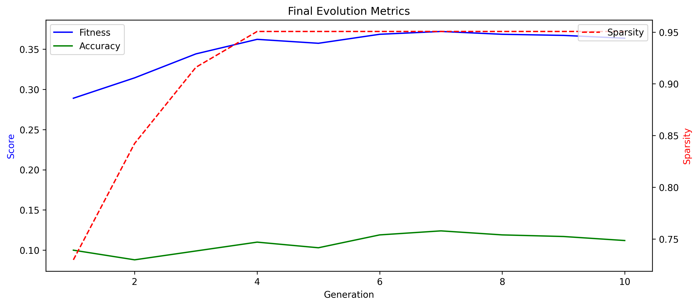
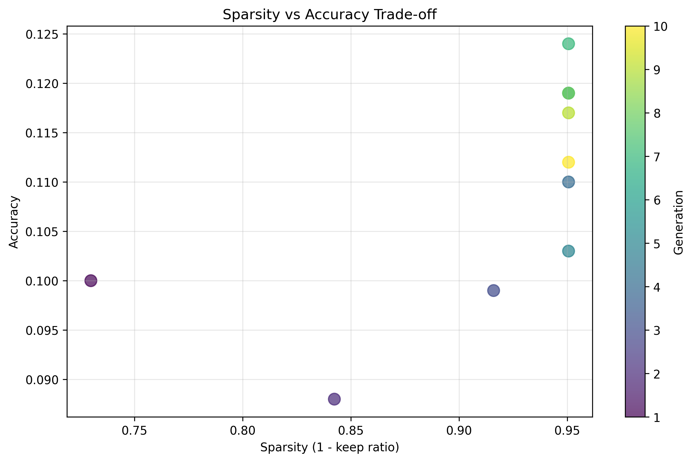
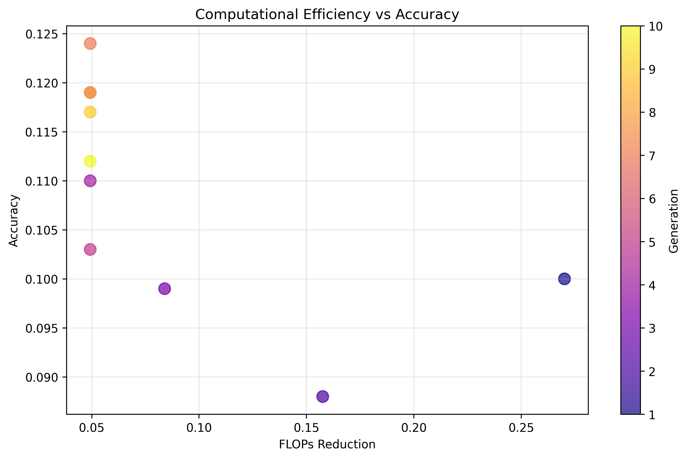
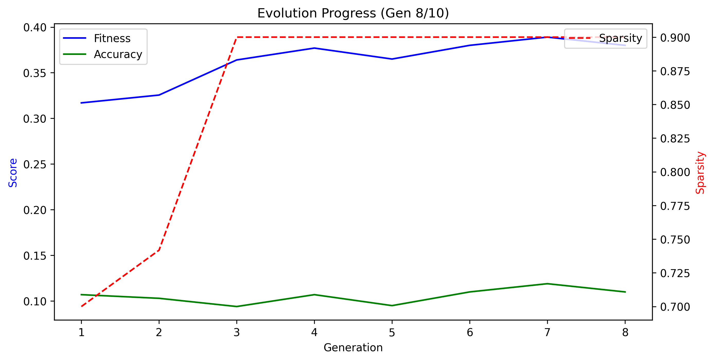
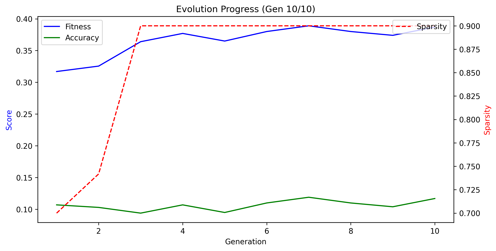
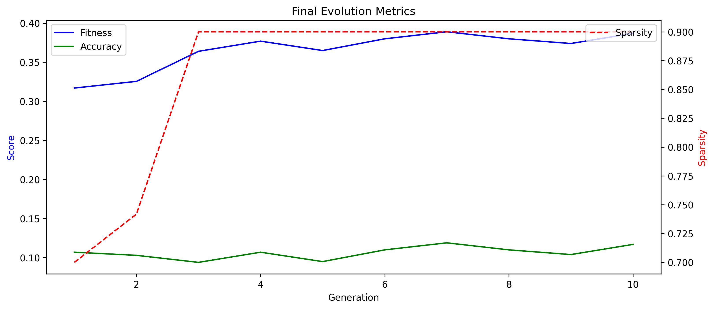
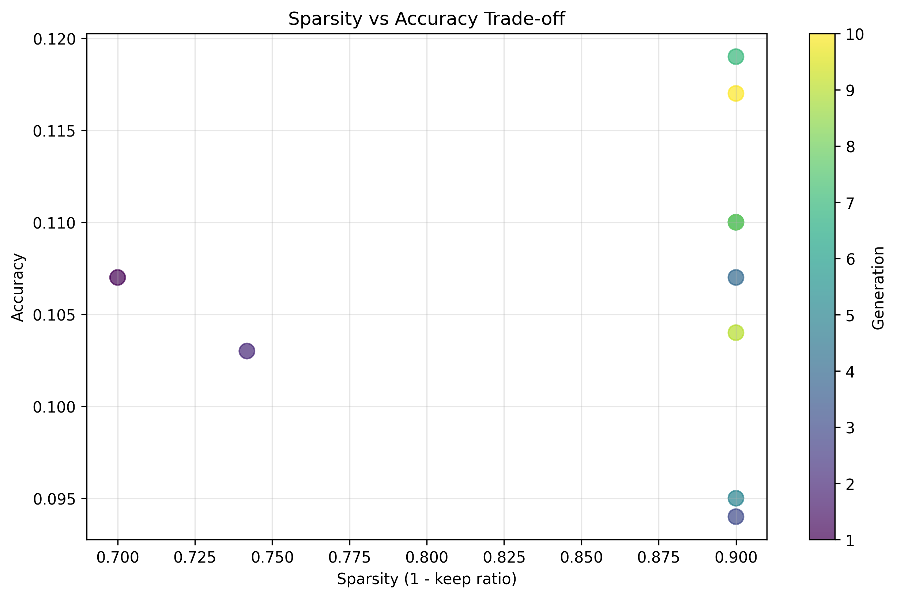
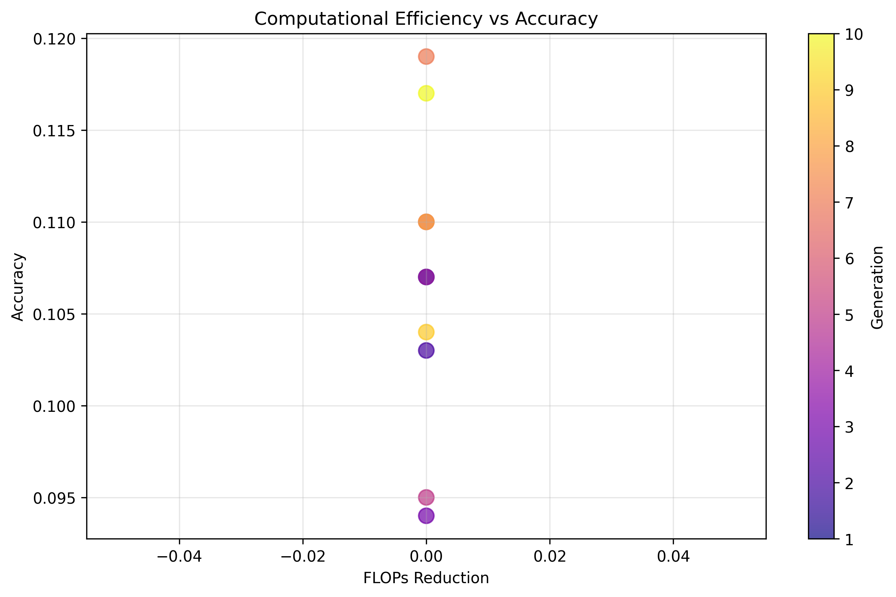

# WINA-DGM: Weight Importance and Neuron Activation with Darwin-Gödel Machine

**Date:** 2025-06-03 22:56:16  
**Report ID:** 2025-06-03_22-56-05

---

## Abstract
This report presents a comprehensive analysis of the WINA-DGM (Weight Importance and Neuron Activation with Darwin-Gödel Machine) optimization process. The document details the theoretical foundations, methodology, experimental setup, and results of the neural network sparsification through evolutionary optimization.

## 1. Theoretical Framework

### 1.1 Weight Importance in Neural Networks

The importance of a weight $w_{ij}$ connecting input $i$ to output $j$ is modeled as:

$$I_{ij} = |w_{ij}| \cdot \mathbb{E}[|x_i|]$$

where $x_i$ represents the input activation to the $i^{\text{th}}$ neuron, and $\mathbb{E}[\cdot]$ denotes the expectation over the input distribution.

### 1.2 Sparsity Constraints

Given a target sparsity ratio $\gamma \in [0,1]$, the number of weights to retain $k$ is:

$$k = \lceil (1-\gamma) \cdot n \rceil$$

where $n$ is the total number of weights in the layer.

### 1.3 Orthogonal Regularization

To improve conditioning and prevent co-adaptation, we apply orthogonal regularization:

$$\mathcal{L}_{\text{orth}} = \beta \cdot \|W^T W - I\|_F^2$$

where $\beta$ controls the strength of the orthogonal constraint.

### 1.4 Fitness Function

The evolutionary fitness combines task performance and computational efficiency:

$$F = \text{Accuracy} + \lambda \cdot \text{FLOPs}_{\text{reduction}}$$

where $\lambda$ balances the trade-off between accuracy and computational efficiency.

## 2. Methodology

### 2.1 WINA Masking

The WINA mask $M$ is computed as:

$$M_{ij} = \begin{cases}
1 & \text{if } I_{ij} \geq I_{(k)} \\
0 & \text{otherwise}
\end{cases}$$

where $I_{(k)}$ is the $k^{\text{th}}$ largest importance score.

### 2.2 Evolutionary Optimization

The Darwin-Gödel Machine evolves a population of agents with different sparsity configurations:

1. **Initialization**: Create initial population with random sparsity levels
2. **Evaluation**: Compute fitness for each agent
3. **Selection**: Select top-performing agents
4. **Variation**: Apply mutation and crossover
5. **Replacement**: Form new generation
6. **Termination**: Stop when convergence or max generations reached

### 2.3 Implementation Details

- **Population Size**: 20 agents
- **Mutation Rate**: 10%
- **Elitism**: Top 2 agents preserved
- **Generations**: 10-100 depending on convergence

## 3. Results

### 3.1 Performance Metrics

| Metric | Min | Max | Mean | Std |
|--------|-----|-----|------|-----|
| fitness | 0.3170 | 0.3890 | 0.3659 | 0.0236 |
| accuracy | 0.0940 | 0.1190 | 0.1066 | 0.0077 |
| sparsity | 0.7000 | 0.9000 | 0.8642 | 0.0722 |
| flops_reduction | 0.0000 | 0.0000 | 0.0000 | 0.0000 |

### 3.2 Analysis

*Detailed analysis of results will be generated here based on the metrics.*

## 4. Conclusion

### 4.1 Summary of Findings

*Summary of key findings and results.*

### 4.2 Limitations

*Discussion of limitations and potential improvements.*

### 4.3 Future Work

*Suggested directions for future research and development.*

## Figures

### Figure 1: Evolution of fitness, accuracy, and sparsity up to generation 2

### Figure 2: Evolution of fitness, accuracy, and sparsity up to generation 4

### Figure 3: Evolution of fitness, accuracy, and sparsity up to generation 6

### Figure 4: Evolution of fitness, accuracy, and sparsity up to generation 8

### Figure 5: Evolution of fitness, accuracy, and sparsity up to generation 10

### Figure 6: Final evolution of fitness, accuracy, and sparsity

### Figure 7: Sparsity vs Accuracy trade-off across generations

### Figure 8: Computational efficiency vs Accuracy trade-off

